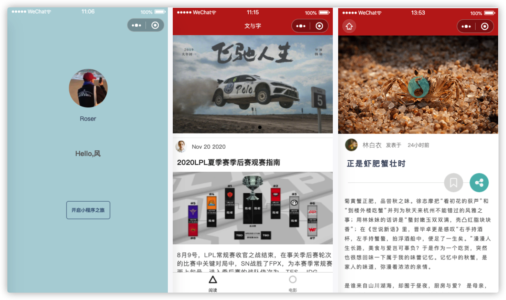

## 练习小程序笔记

> **使用Lin UI组件库打造的微信小程序项目，简单模仿豆瓣评分微信小程序**

### 项目功能

- 阅读
  - 阅读文章
  - 收藏文章
  - 分享文章
  - 播放音乐



- 电影
  - 正在热映
  - 即将上映
  - 豆瓣Top250
  - 搜索电影
  - 电影详情


### Lin UI安装

**使用npm安装**

打开小程序的项目根目录，执行下面的命令

```sh
npm init
```

此时，会生成一个package.json文件

接着，继续执行下面的命令。

```sh
npm install lin-ui
```

执行成功后，会在根目录里生成项目依赖文件夹 `node_modules/lin-ui` 
然后用小程序官方IDE打开小程序项目，找到 `工具` 选项，点击下拉选中 `构建npm` ，等待构建完成即可。


### 使用Lin UI组件

**全局配置文件/页面配置文件**

```js
"usingComponents": {
  "l-search-bar": "/miniprogram_npm/lin-ui/search-bar/index",
  "l-rate":"/miniprogram_npm/lin-ui/rate/index"
}
// 等等
```


### 使用的微信API

```js
wx.switchTab  // 跳转到 tabBar 页面
wx.navigateTo  // 跳转到应用内的某个页面，除了tabbar 页面
wx.showActionSheet  // 显示操作菜单
wx.getBackgroundAudioManager()  // 获取全局唯一的背景音频管理器
// 实例属性
- mgr.src = music.url  // mgr为wx.getBackgroundAudioManager()实例
- mgr.title = music.title
- mgr.coverImgUrl = music.coverImg
// 实例方法
- mgr.onPlay(this.onMusicStart)  
- mgr.onPause(this.onMusicStop)
- mgr.onEnded(this.onMusicStop)

wx.setNavigationBarTitle  // 动态设置当前页面的标题
// 等等
```


### 使用的微信小程序内置组件

```js
swiper  // 滑块视图容器
swiper-item  //swiper子组件
scroll-view  // 可滚动视图区域
// 等等
```


### 使用的全局配置

```js
tabBar  // 底部 tab 栏的表现
requiredBackgroundModes  // 需要在后台使用的能力，如「音乐播放」
usingComponents // 全局自定义组件
// 等等
```


### 使用的页面配置

```js
navigationBarBackgroundColor  // 导航栏背景颜色
navigationBarTitleText  // 导航栏标题文字内容
enablePullDownRefresh  // 是否开启当前页面下拉刷新
// 等等
```


### 自定义组件

外部样式类  externalClasses

自定义触发事件 this.triggerEvent( )


